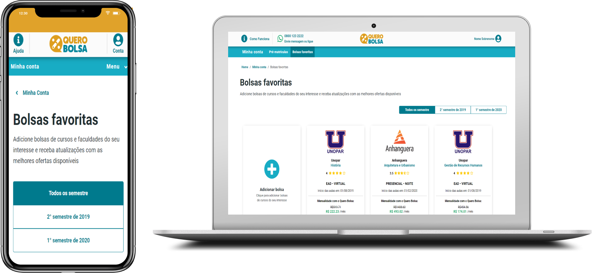

<h4 align="center">
  Quero Bolsa
</h4>

<p align="center">
  <a href="#Laptop-projeto">Projeto</a>&nbsp;&nbsp;&nbsp;|&nbsp;&nbsp;&nbsp;
  <a href="#⌨️ Instalando">Instalando</a>&nbsp;&nbsp;&nbsp;|&nbsp;&nbsp;&nbsp;
  <a href="#rocket-tecnologias">Tecnologias</a>&nbsp;&nbsp;&nbsp;|&nbsp;&nbsp;&nbsp;
  <a href="#memo-licença">Licença</a>
</p>

<br>

<p align="center">
  
</p>

## 💻 Projeto

Projeto desenvolvido como teste técnico para vaga de Front-End developer da Quero Educação.

## ⌨️ Instalando

**Clonando repositório**
```
$ git clone https://github.com/sealove20/quero-edu.git
$ cd quero-edu
```

**Instalando dependências**
```
$ yarn
```

__ou__

```
$ npm install
```

**Rodando o site**
```
$ yarn start
```

__ou__

```
$ npm run start
```

**Rodando os testes**
```
$ yarn test
```

__ou__

```
$ npm run test
```

## :rocket: Tecnologias

Esse projeto foi desenvolvido com as seguintes tecnologias:

- [React](https://reactjs.org)
- [Sass](https://sass-lang.com/)
- [PropTypes](https://www.npmjs.com/package/prop-types)
- [Jest](https://jestjs.io/)


## :memo: Licença

Esse projeto está sob a licença MIT. Veja o arquivo [LICENSE](LICENSE.md) para mais detalhes.

---
